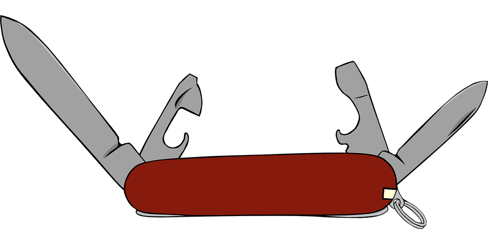

# multi-tool


<p align='center'></p>

A Ruby based DevOps Framework Tool for Container-based Development

Multi-tool provides a consistent set of common tools for developers to manage tasks in a container native world. Firstly, it bundles a set of useful tools and secondly, it comes bundled with the *ruby* programming language and the [rake](https://github.com/ruby/rake)
*make* tool. This enables a near zero-install toolbox that lets you to quickly
specify build rules, or *tasks* for your projects.

Currently supports: **AWS**, **Google Cloud**

TODO: Add Azure

The current tool set includes the following tools:
1. ruby : the ruby programming language
1. rake : the rake build tool
1. terraform : the Hashicorp Infrastructure as Code tool
1. packer : the Hashicorp tool to build Machine Images
1. docker : a docker client to enable docker in docker CICD tasks
1. docker-compose : the docker-compose client to spin up docker containers using its specification
1. kubectl : the Kubernetes API client
1. helm : the Kubernetes deployment packaging tool
1. cloud cli's : aws, gcloud
1. ruby aws-sdk, google-cloud
1. ~~chef inspec : for IT Security and Compliance as Code~~ waiting for AWS SDK 3 support
1. ruby terraforming : used to initialize terraform projects from existing infrastructure

## Getting Started

To get started, make a copy of the the multi-tool bash script, copy it into your path and ensure that it is executable.

**Run the container with the default output **

```bash
> multi-tool
multi-tool - a tool for building and managing cloud infrastructure without a low installation footprint

multi-tool currently offers a Ruby Rake framework with the following tools available:
    - terraform
    - packer
...

```
**To learn about the available rake rules**
```bash
> multi-tool -T
rake help  # Display a description of gantry-yard with helpful information
```

**To run an available rake rule**
```bash
> multi-tool -t {rake rule}
```

**To run run one of the included tools directly**

For example, to print out the version number of terraform

```bash
> multi-tool terraform version
Terraform v0.10.6

```

## Using multi-tool

**multi-tool** comes with the bash script `multi-tool`. This will run the multi-tool container with appropriate volume mounts to
access files and credentials.

**Usage:** multi-tool [-c workdir] [-d] [-T] [-t] [tool tool_args]

* -c : run multi-tool from within another docker container and use its volume mounts using
the workdir argument as the working directory for the multi-tool container. This is useful for CIDCD tools like Jenkins
* -d : debug mode. Drop into the container using bash as an interactive entry point. This is useful if you're going to interactively
use a number of the tools. It will mount your current working directory, so you'll have access to your local files.
* -t : run a rake task
* -T : display available rake tasks

If you take a closer look at the multi-tool script you'll find the following mount points which may not always be required:

* /mthome/.aws  to access your AWS credentials
* /mthome/.config to access your Google Cloud credentials
* /mthome/.ssh to access your own ssh credentials
* /mthome/.kube to access your Kubernetes kubectl configuration
* /mthome/.helm to access your Helm starters and repos
* /var/run/docker.sock to share a docker socket for docker commands within the container


## Writing Your Own Tasks

**multi-tool** will look for a `tasks` directory under the current working directory. When it finds this directory, it will
load all of the ruby code that is found there. This can be your own rake tasks, or ruby library code you've written to support
your tasks.

Here's an example:

```bash
# Create the tasks directory
> mkdir tasks

# Add a ruby file with a rake task

cat <<EOF > tasks/my_tasks.rb
namespace :my_project do
  desc 'Here is my example task'
  task :example, [:first, :second] do |t, args|
    puts args[:first]
    puts args[:second]
  end
end
EOF

> multi-tool -T
rake help                              # Display a description of gantry-yard with helpful information
rake my_project:example[first,second]  # Here is my example task

# Run multi-tool with this task
> multi-tool -t my_project:example[hello, world]
hello
world
```
